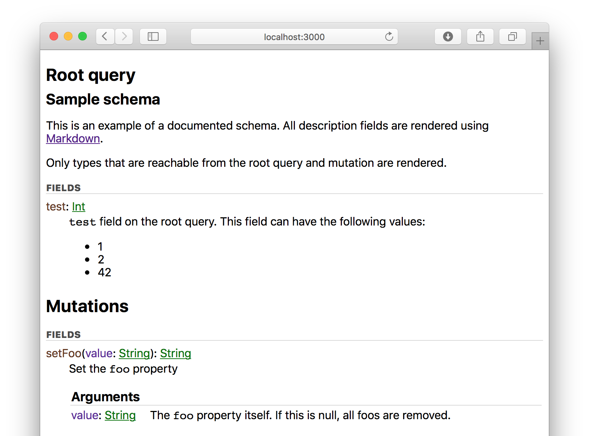

# GraphQL Documentation Explorer

Dynamically generated documentation explorer for [GraphQL](http://graphql.org)
schemas. It aims to provide a better overview of a schema than
[GraphiQL](https://github.com/graphql/graphiql), but without querying features.

[](https://travis-ci.org/mhallin/graphql-docs)
[](https://www.npmjs.com/package/graphql-docs)

---



## Installation and usage

GraphQL-Docs supports both a dynamic mode and a static mode. In dynamic mode,
GraphQL-Docs tries to work similarly to GraphiQL. Either use the minified files
from GitHub:

```html
<script src="https://github.com/mhallin/graphql-docs/releases/download/v0.2.0/graphql-docs.min.js"></script>
<!-- Note that you need to include React and ReactDOM *before* this script tag -->
```

Or download it into your own package via NPM:

```sh
npm install --save graphql-docs
```

GraphQL-Docs exposes a single React component that requires a function to run a
query against a server and return a `Promise` with the result:

```javascript
function fetcher(query) {
    return fetch(window.location.origin + '/graphql', {
        method: 'POST',
        headers: {
            Accept: 'application/json',
            'Content-Type': 'application/json',
        },
        body: JSON.stringify({
            query: query,
        }),
    }).then(function(r) {
        return r.json();
    });
}

ReactDOM.render(<GraphQLDocs.GraphQLDocs fetcher={fetcher} />, document.body);
```

All CSS is included in the Javascript code, so no other dependencies are
required. You can find examples of both the first and second paradigms in the
examples folder.

## Static documentation generation

You can also generate a static documentation file based on a schema file or
GraphQL endpoint:

```sh
npm install -g graphql-docs

graphql-docs-gen http://GRAPHQL_ENDPOINT documentation.html
```

## Features

* Markdown rendered documentation (using
  [Marked](https://github.com/chjj/marked)).
* All types and fields are recursively searched from the schema's root query and
  mutation objects. Types that can't be queried are not included.
* Field arguments listed in separate tables in the cases where they *do* contain
  a description.

### Planned features

* Improved layout with some sort of navigation
* On-page search
